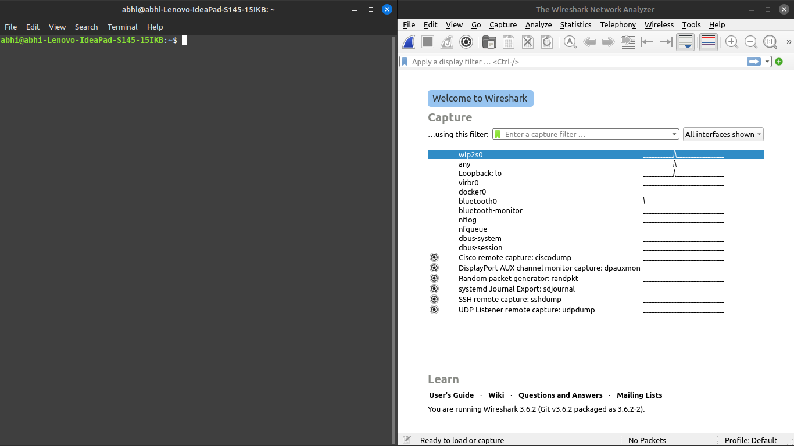
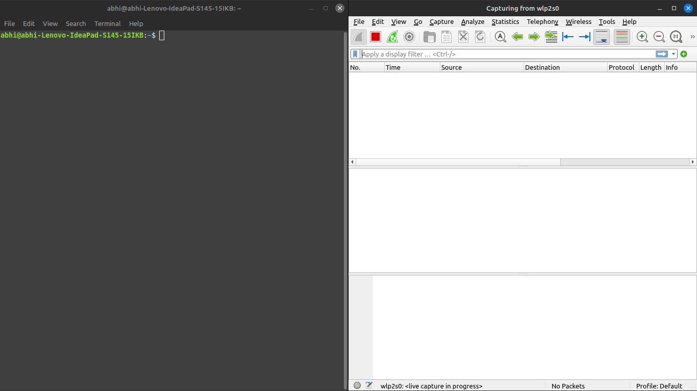
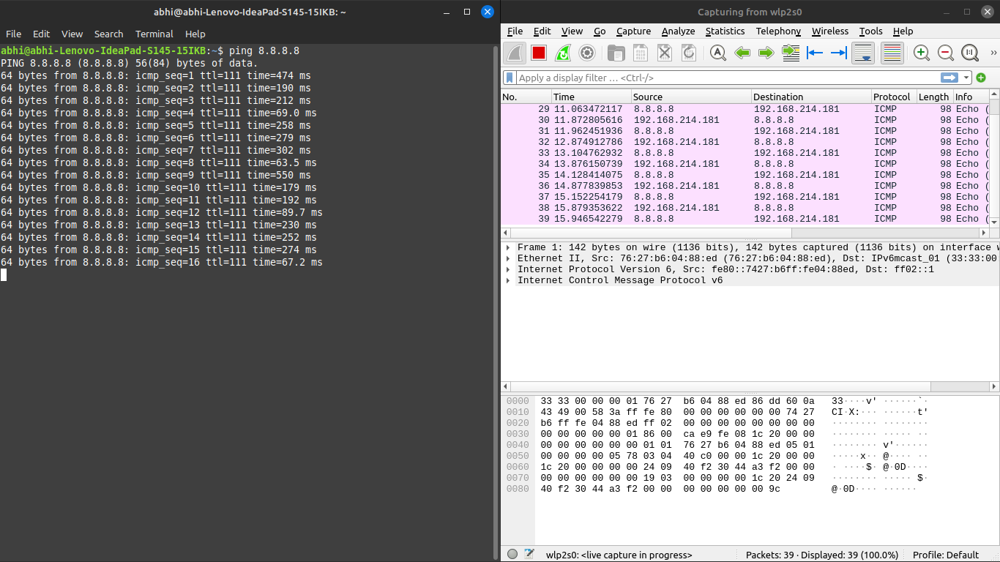
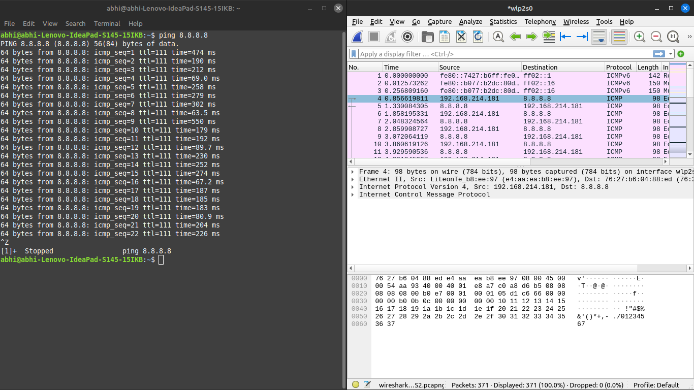
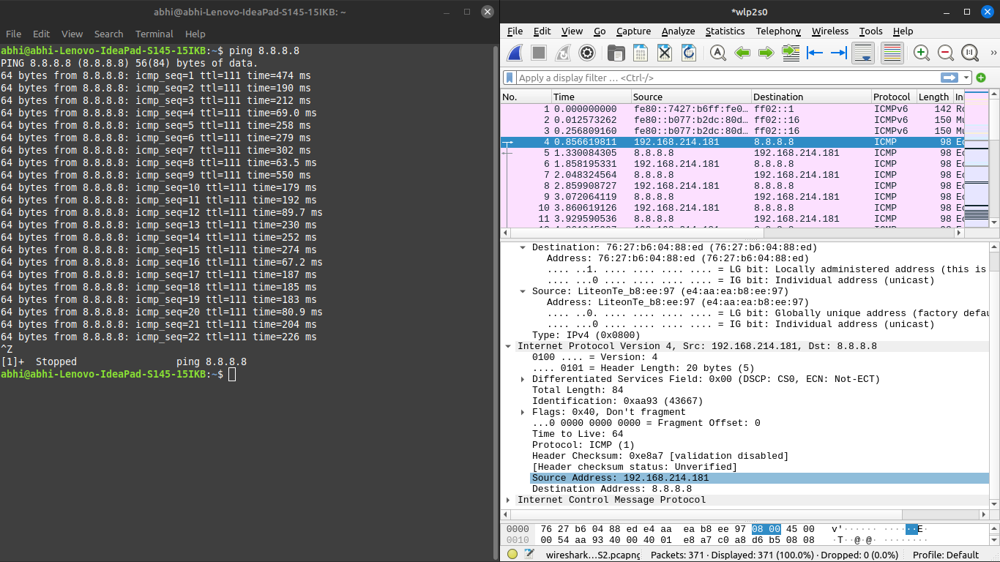
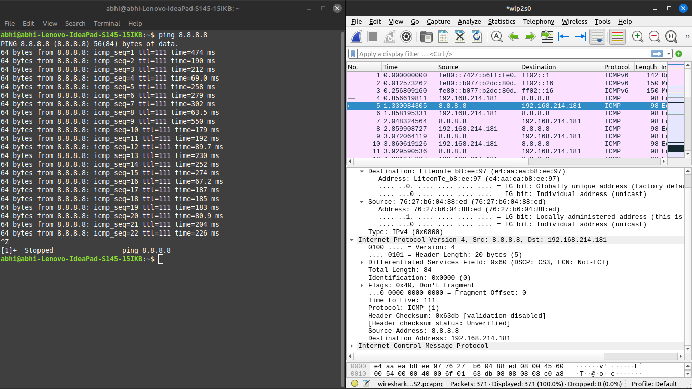
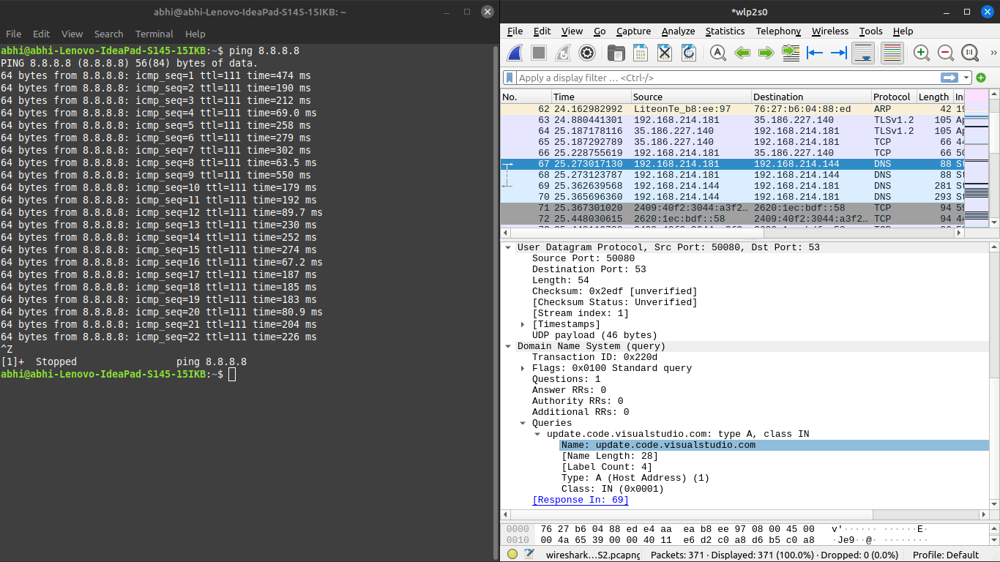

# Wireshark

## let's try and ping google server and find the ping request in wireshark

### Staring wireshark and select the wifi capture

### Starting the packet capture

### Ping google servers

### looking at the ICMP packet request sent to 8.8.8.8

### looking at the source and destination address in the packet

### The ICMP response

### Other Traffic caught by wire shark
dns request sent to the vs code servers for updates
