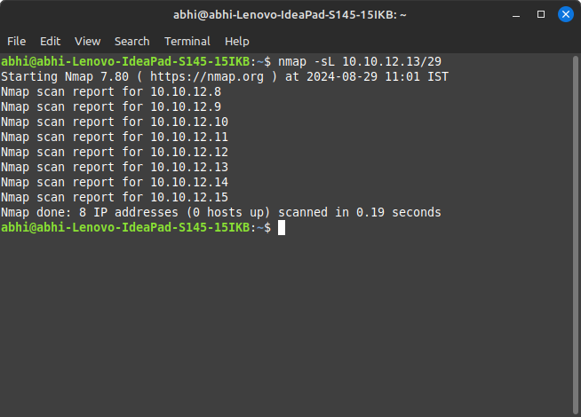
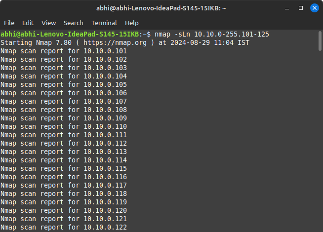
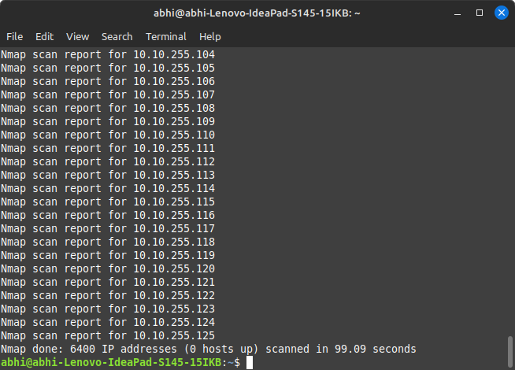
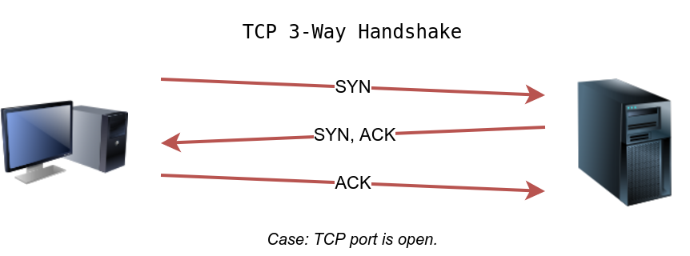

# tryhackme nmap room
https://tryhackme.com/r/room/nmap01

 Nmap is an industry-standard tool for mapping networks, identifying live hosts, and discovering running services. Nmap’s scripting engine can further extend its functionality, from fingerprinting services to exploiting vulnerabilities. A Nmap scan usually goes through the steps shown in the figure below

 

## Enumerating Targets

Ways to scan in nmap:
    list: ```MACHINE_IP scanme.nmap.org example.com``` will scan 3 IP addresses.
    range: ```10.11.12.15-20``` will scan 6 IP addresses: 10.11.12.15, 10.11.12.16,… and 10.11.12.20.
    subnet: ```MACHINE_IP/30``` will scan 4 IP addresses.
    file: provide a file as input for your list of targets nmap -iL list_of_hosts.txt.

If you want to check the list of hosts that Nmap will scan, you can use ```nmap -sL TARGETS```





## Discovering Live Hosts

We will leverage the protocols to discover the live hosts. Starting from bottom to top, we can use:

* ARP from Link Layer
* ICMP from Network Layer
* TCP from Transport Layer
* UDP from Transport Layer

## Nmap Host Discovery Using ARP

Nmap follows the following approaches to discover live hosts:

* When a privileged user tries to scan targets on a local network (Ethernet), Nmap uses ARP requests. A privileged user is root or a user who belongs to sudoers and can run sudo.
* When a privileged user tries to scan targets outside the local network, Nmap uses ICMP echo requests, TCP ACK (Acknowledge) to port 80, TCP SYN (Synchronize) to port 443, and ICMP timestamp request.
* When an unprivileged user tries to scan targets outside the local network, Nmap resorts to a TCP 3-way handshake by sending SYN packets to ports 80 and 443.


## Nmap Host Discovery Using ICMP

To use ICMP echo request to discover live hosts, add the option -PE. (Remember to add -sn if you don’t want to follow that with a port scan.) As shown in the following figure, an ICMP echo scan works by sending an ICMP echo request and expects the target to reply with an ICMP echo reply if it is online.


Nmap uses timestamp request (ICMP Type 13) and checks whether it will get a Timestamp reply (ICMP Type 14). Adding the -PP option tells Nmap to use ICMP timestamp requests. As shown in the figure below, you expect live hosts to reply.


Similarly, Nmap uses address mask queries (ICMP Type 17) and checks whether it gets an address mask reply (ICMP Type 18). This scan can be enabled with the option -PM. As shown in the figure below, live hosts are expected to reply to ICMP address mask requests.


## Nmap Host Discovery Using TCP and UDP
TCP handshake



TCP SYN Ping

If you want Nmap to use TCP SYN ping, you can do so via the option -PS followed by the port number, range, list, or a combination of them. For example, -PS21 will target port 21, while -PS21-25 will target ports 21, 22, 23, 24, and 25. Finally -PS80,443,8080 will target the three ports 80, 443, and 8080.

Privileged users (root and sudoers) can send TCP SYN packets and don’t need to complete the TCP 3-way handshake even if the port is open, as shown in the figure below. Unprivileged users have no choice but to complete the 3-way handshake if the port is open.


TCP ACK Ping

This sends a packet with an ACK flag set. You must be running Nmap as a privileged user to be able to accomplish this. If you try it as an unprivileged user, Nmap will attempt a 3-way handshake.

By default, port 80 is used. The syntax is similar to TCP SYN ping. -PA should be followed by a port number, range, list, or a combination of them. For example, consider -PA21, -PA21-25 and -PA80,443,8080. If no port is specified, port 80 will be used.

The following figure shows that any TCP packet with an ACK flag should get a TCP packet back with an RST flag set. The target responds with the RST flag set because the TCP packet with the ACK flag is not part of any ongoing connection. The expected response is used to detect if the target host is up.


UDP Ping

In the following figure, we see a UDP packet sent to an open UDP port and not triggering any response. However, sending a UDP packet to any closed UDP port can trigger a response indirectly indicating that the target is online. 

Nmap uses -PU for UDP ping. In the following example, we use a UDP scan, and we discover five live hosts.


## Using Reverse-DNS Lookup

Nmap’s default behaviour is to use reverse-DNS online hosts. Because the hostnames can reveal a lot, this can be a helpful step. However, if you don’t want to send such DNS queries, you use -n to skip this step.

By default, Nmap will look up online hosts; however, you can use the option -R to query the DNS server even for offline hosts. If you want to use a specific DNS server, you can add the --dns-servers DNS_SERVER option.

## Summary

You have learned how ARP, ICMP, TCP, and UDP can detect live hosts by completing this room. Any response from a host is an indication that it is online. Below is a quick summary of the command-line options for Nmap that we have covered.
|Scan Type 	|Example Command                |
|-----------|-------------------------------|
|ARP Scan 	|sudo nmap -PR -sn MACHINE_IP/24|
|ICMP Echo Scan 	|sudo nmap -PE -sn MACHINE_IP/24|
|ICMP Timestamp Scan 	|sudo nmap -PP -sn MACHINE_IP/24|
|ICMP Address Mask Scan 	|sudo nmap -PM -sn MACHINE_IP/24|
|TCP SYN Ping Scan 	|sudo nmap -PS22,80,443 -sn MACHINE_IP/30|
|TCP ACK Ping Scan 	|sudo nmap -PA22,80,443 -sn MACHINE_IP/30|
|UDP Ping Scan 	|sudo nmap -PU53,161,162 -sn MACHINE_IP/30|

Remember to add -sn if you are only interested in host discovery without port-scanning. Omitting -sn will let Nmap default to port-scanning the live hosts.
|Option 	|Purpose|
|-----------|-------|
|-n 	|no DNS lookup|
|-R 	|reverse-DNS lookup for all hosts|
|-sn 	|host discovery only|

